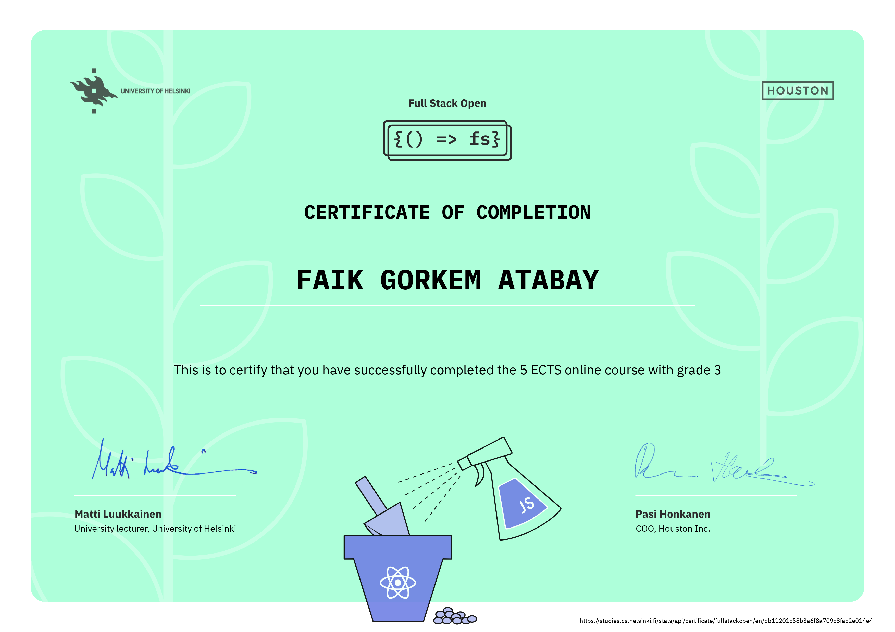

## ultimate-hooks

To run the app:

- Navigate to ultimate-hooks directory and run **npm install**
- Run command **npm run server** to start [json-server](https://github.com/typicode/json-server)
- Run command **npm start**

---

University of Helsinki Certificate

Certificate link: https://studies.cs.helsinki.fi/stats/api/certificate/fullstackopen/en/db11201c58b3a6f8a709c8fac2e014e4
